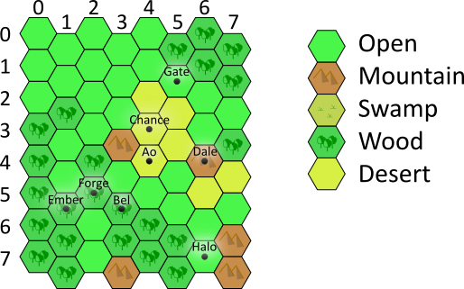
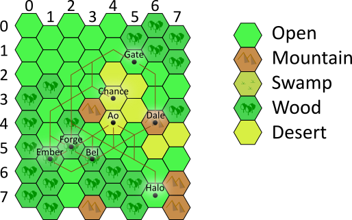

You have a map of hexagonal tiles. Each tile has coordinates (column, row).
For example: 

Each tile has a terrain type. There are five different types of terrain:
 mountain, wood, open, swamp, and desert. On some tiles there are cities.
The cities in the map above are on tiles: Ao (4,4), Bel (3,5), Chance (4,3),
 Dale (6,4), Ember (1,5), Forge (2,5), Gate (5,1), Halo (6,7)
 
 A city has resources. There are six types of resources: produce, wood,
  stone, clay, ore, and textile. Each city is missing some resource or
  resources.
 
 In this example:
 * Ao has stone
 * Bel has produce and stone
 * Chance has textile and clay
 * Dale has wood and clay
 * Ember has ore, textile and clay
 * Forge has ore and stone
 * Gate has ore
 * Halo has produce and ore
 
 Each terrain type has a movement cost:
 * Mountain = 6
 * Wood = 2
 * Open = 1
 * Swamp = 4
 * Desert = 7
 
 Your job is to find the minimal roads system with the minimal total cost,
  per city, that will enable all the cities access to all the resources.
 
 Here is the solution for the map above: 
 
 
 
 The input is a description of map:
 * a list of columns, each a list of tiles
 * a list of cities (the city coordinates and the resources it has)
 
 Example input (same as the map above):
 
 [open, open, open, wood, wood, wood, wood, wood], 
 [open, open, wood, open, open, wood, wood, wood], 
 [open, open, open, open, wood, wood, open, open], 
 [open, open, open, mountain, open, wood, wood, mountain], 
 [open, open, desert, desert, desert, open, wood, wood], 
 [wood, open, desert, desert, open, open, wood, wood], 
 [wood, wood, open, open, mountain, desert, open, open], 
 [wood, wood, open, wood, desert, open, mountain, mountain]

 Cities:
 
	(4, 4), Stone
	(3, 5), Produce, Stone
	(4, 3), Textile, Clay
	(6, 4), Wood, Clay
	(1, 5), Ore, Textile, Clay
	(2, 5), Ore, Stone
	(5, 1), Ore
	(6, 7), Produce, Ore

The solution should be a text describing the roads, each line a road. A road is a list of tiles.

For example (part of the solution to the example):

(6, 7), (6, 6), (5, 5), (4, 5), (3, 5) 
(6, 7), (6, 6), (5, 5), (4, 5), (3, 4), (2, 5), (1, 5) 
(6, 7), (6, 6), (5, 5), (5, 4), (6, 4) 
...

The input is at http://3.122.27.254/map
Post your solution at http://3.122.27.254/solution

